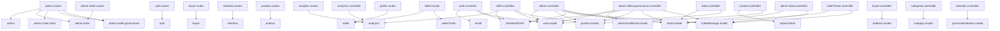

```mermaid
flowchart TD

admin.routes --> admin
admin.routes --> admin.ticket
admin.routes --> admin.ticket.stats
admin.routes --> admin.seller.governance
admin.routes --> admin.seller.governance
admin.ticket.routes --> admin.ticket
analytics.routes --> analytics
auth.routes --> auth
buyer.routes --> buyer
intention.routes --> intention
product.routes --> product
public.routes --> seller
seller.routes --> seller
seller.routes --> sellerTicket
admin.controller --> user.model
admin.controller --> product.model
admin.controller --> VendedorPerfil
admin.controller --> ticket.model
admin.controller --> ticketMessage.model
admin.controller --> ticket.model
admin.seller.governance.controller --> VendedorPerfil
admin.seller.governance.controller --> user.model
admin.seller.governance.controller --> adminAuditEvent.model
admin.seller.governance.controller --> product.model
admin.seller.governance.controller --> ticket.model
admin.seller.governance.controller --> ticketMessage.model
admin.ticket.controller --> ticket.model
admin.ticket.controller --> ticketMessage.model
analytics.controller --> analytics
auth.controller --> email
auth.controller --> user.model
auth.controller --> VendedorPerfil
buyer.controller --> Address.model
categories.controller --> category.model
intention.controller --> purchaseIntention.model
product.controller --> authorization
product.controller --> product.model
seller.controller --> analytics
seller.controller --> VendedorPerfil
seller.controller --> user.model
seller.controller --> product.model
sellerTicket.controller --> ticket.model
sellerTicket.controller --> ticketMessage.model
ticket.controller --> ticket.model
ticket.controller --> user.model
```
